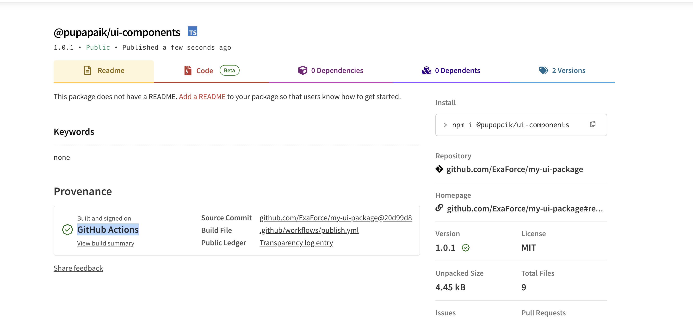
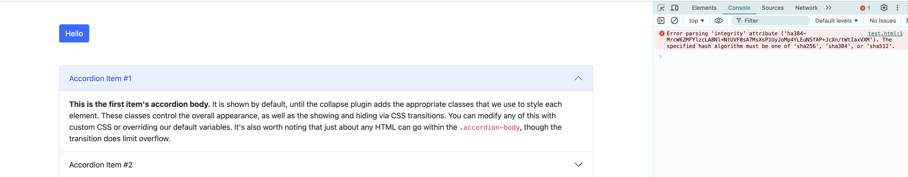

# my-ui-package

This repo shows how to publish package with provenance flag

## Default verification in NPM

NPM has command audit that can be used to verify package integrity and attestation. However it does not support individual package verification. It verifies all packages in the project.

Also I was not able to make it work with default npm CLI installed in my MAC. It has to be run from the project directory via `./node_modules/.bin/npm audit signatures` command.

```
$ ./node_modules/.bin/npm audit signatures
audited 249 packages in 3s

249 packages have verified registry signatures

84 packages have verified attestations
```

Bad verification output

```
$ npm audit signatures
audited 249 packages in 4s

168 packages have verified registry signatures

3 packages have verified attestations

1 packages have invalid attestations:

@pupapaik/ui-components@1.0.0 (https://registry.npmjs.org/)

Someone might have tampered with these packages since they were published on the registry!
```


## How to verify NPM package integrity and attestation

Custom verication script for getting package integrity and attestation based on version.

```
$ ./verify-npm-package.sh @pupapaik/ui-components  1.0.0
🔍 Analyzing package: @pupapaik/ui-components
📦 Fetching package information...

📥 Verifying package tarball...
✅ SHA-1 hash verification passed
❌  No attestation URL found

$ ./verify-npm-package.sh @pupapaik/ui-components  1.0.1
🔍 Analyzing package: @pupapaik/ui-components
📦 Fetching package information...

📥 Verifying package tarball...
✅ SHA-1 hash verification passed
✅ Found attestation URL: https://registry.npmjs.org/-/npm/v1/attestations/@pupapaik%2fui-components@1.0.1
```

https://www.npmjs.com/package/@pupapaik/ui-components/v/1.0.2?activeTab=versions




Link to repo with workflow https://github.com/ExaForce/my-ui-package/blob/main/.github/workflows/publish.yml#L44

## CDN client side signature

By using integrity attribute in script tag it is possible to verify that the script was not tampered with. This is useful for example when using CDN to load scripts.

```
    <script
        src="https://cdn.jsdelivr.net/npm/bootstrap@5.0.2/dist/js/bootstrap.bundle.min.js"
        integrity="sha384-MrcW6ZMFYlzcLA8Nl+NtUVF0sA7MsXsP1UyJoMp4YLEuNSfAP+JcXn/tWtIaxVXM"
        crossorigin="anonymous">
    </script>
```



